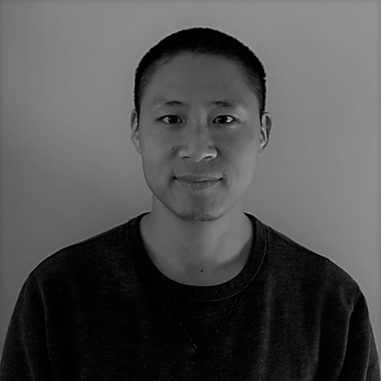

---
---

# <link rel="stylesheet" href="styles.css" type="text/css">

#### Associate Research Scientist

@ [Lamont-Doherty Earth Observatory](https://www.ldeo.columbia.edu/){target="_blank"} of [Columbia University](https://www.columbia.edu/){target="_blank"}
  
61 Route 9W  
Palisades, NY 10964 USA
  
+1 (845)365-8629  
qyang@LDEO.columbia.edu
  
  
My full CV is available [here](files/Qiang Yang_CV_2020sep.pdf){target="_blank"}.
  
______________________________________________

&copy; 2018-10 | by <a href="http://www.ldeo.columbia.edu/~qyang">Qiang Yang</a> 

